# 🚀 DevOps Portfolio: CI/CD Build + Manual Kubernetes Deployment

This guide walks you through setting up a GitHub Actions pipeline that builds and pushes your Dockerized portfolio to Docker Hub, followed by a manual Kubernetes deployment using Minikube. Includes cleanup steps.

---

## 📁 Project Structure

```
├── index.html
├── Dockerfile
├── k8s/
│   ├── deployment.yaml
│   └── service.yaml
└── .github/
    └── workflows/
        └── build.yml
```

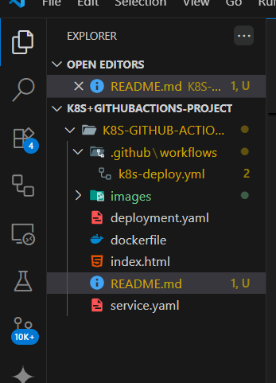

---

## 🧱 Prerequisites

- GitHub Repository with Dockerfile and app code
- Docker Hub account and repo
- Minikube installed locally
- `kubectl` configured to access your local Minikube
- Lens (optional, for Kubernetes visualization)

---

## 🔄 Step 1: GitHub Actions Workflow

- Clone and initialize github repository in the working folder.
- Set the repo as main branch.
- And then set it as the origin for every push.

```bash
git init
git clone https://github.com/Username/repo-name.git
git branch -M main
git remote add origin https://github.com/Username/repo-name.git
```

- In the working folder create a new folder named ".github"
- Inside ".github", create another folder named "workflows" #contains all github actions files
- Inside Workflows, create a new yaml file "k8s-deploy.yml"
- Copy and paste below workflow into the file to start build process.

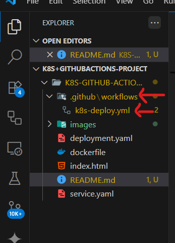

📄 `.github/workflows/k8s-deploy.yml`

```yaml
name: Build & Push Docker Image

on:
  push:
    branches:
      - main

jobs:
  build:
    runs-on: ubuntu-latest
    steps:
      - name: Checkout code
        uses: actions/checkout@v3

      - name: Set up Docker Buildx
        uses: docker/setup-buildx-action@v3

      - name: Log in to Docker Hub
        uses: docker/login-action@v3
        with:
          username: ${{ secrets.DOCKERHUB_USERNAME }}
          password: ${{ secrets.DOCKERHUB_TOKEN }}

      - name: Build and Push to Docker Hub
        uses: docker/build-push-action@v5
        with:
          context: .
          push: true
          tags: rashidacloud/rashida-portfolio:latest
```

### 🔐 Required GitHub Secrets

| Name                | Description                      |
|---------------------|----------------------------------|
| `DOCKERHUB_USERNAME`| Your Docker Hub username         |
| `DOCKERHUB_TOKEN`   | A token generated from Docker Hub |

### TO ADD SECRETS IN GITHUB

- Go to the Repository containing the files on your GitHub console
- Go to settings

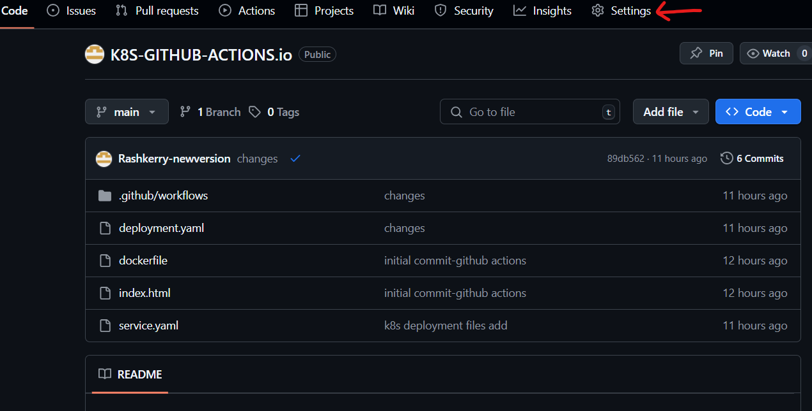

- Scroll down to Secrets and Variables → Actions → Add Repository Secret

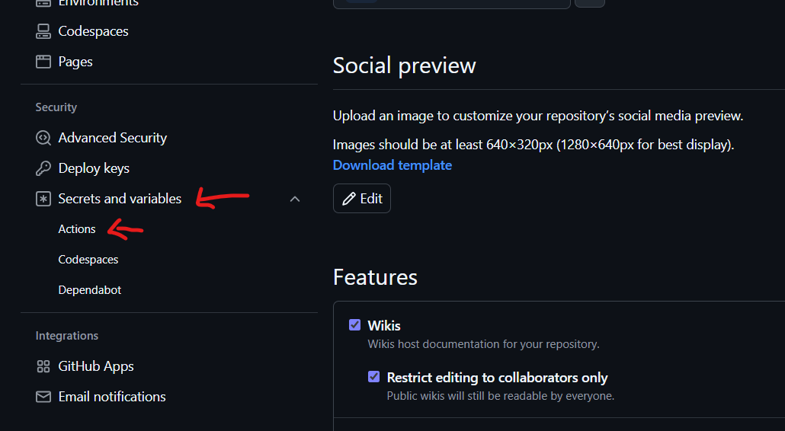

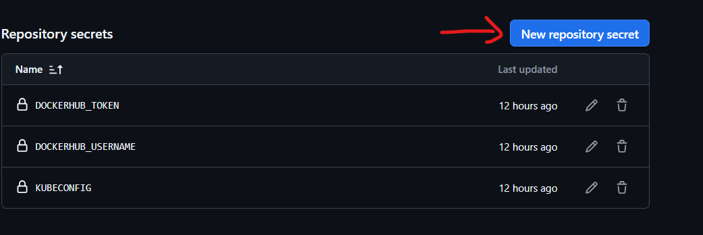

- Enter dockerhub username as the secret and the name `DOCKERHUB_USERNAME`
- To get dockerhub token
   Go to dockerhub desktop
   Click on profile and go to account settings (this will take you to dockerhub web)
  
   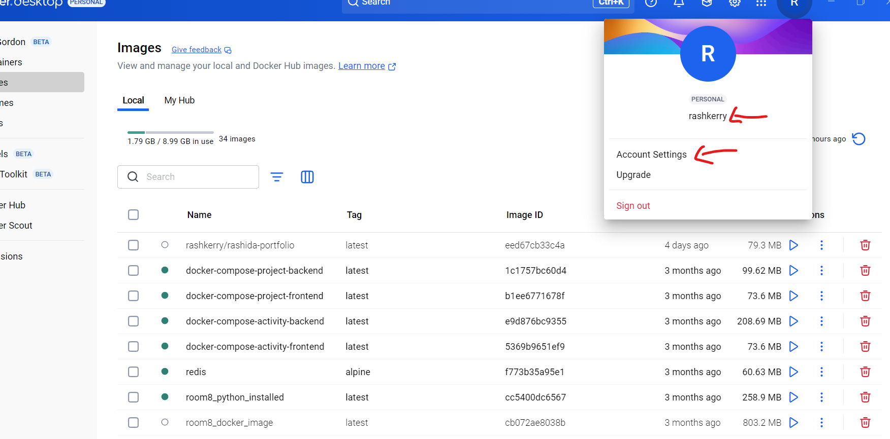

   Under settings go to personal access tokens
   Then generate a new token
   Give it a name and set the expiry date. Make sure to give it read and write access

   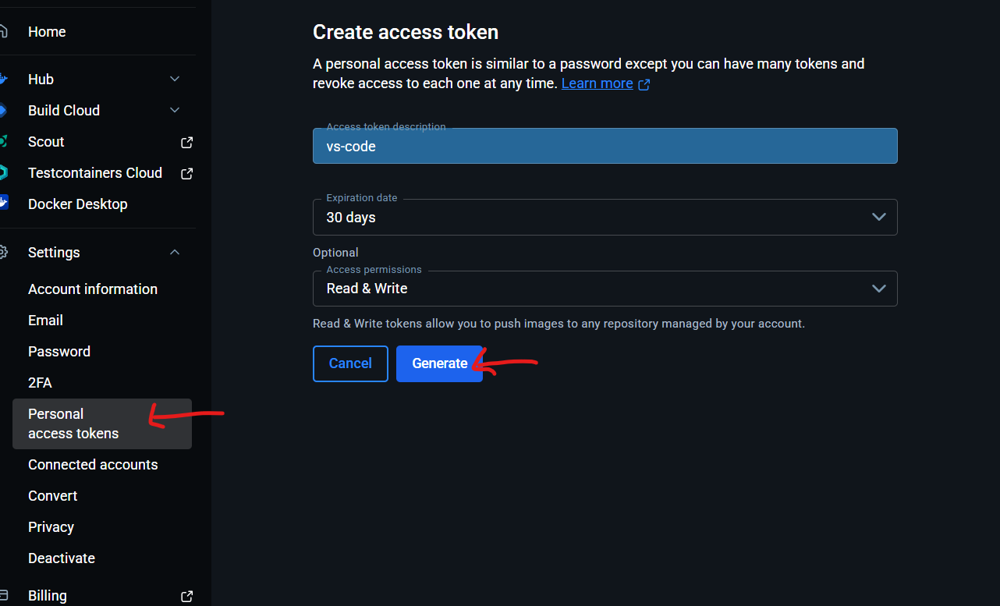

- Copy the token and add it as a secret with name `DOCKERHUB_TOKEN`  
- From there push contents to GitHub to start build process.

```bash
git add .
git commit -u "commit message"
git push -u origin main
```

- Go to Actions in your GitHub Repo to see the deployment


---

## ☸️ Step 2: Manual Kubernetes Deployment

- Start Minikube:

```bash
minikube start
```

- Create the Kubernetes deployment files and paste the yaml script:

📄 `deployment.yaml`

```yaml
apiVersion: apps/v1
kind: Deployment
metadata:
  name: portfolio-deployment
spec:
  replicas: 1
  selector:
    matchLabels:
      app: portfolio
  template:
    metadata:
      labels:
        app: portfolio
    spec:
      containers:
      - name: portfolio
        image: <dockerhubusername>/<image-name>:latest
        ports:
        - containerPort: 80
```

- Create a new file in project directory for the service script below:

📄 `service.yaml`

```yaml
apiVersion: v1
kind: Service
metadata:
  name: portfolio-service
spec:
  type: NodePort
  selector:
    app: portfolio
  ports:
    - port: 80
      targetPort: 80
      nodePort: 30080
```

- Apply the resources:

```bash
kubectl apply -f deployment.yaml
kubectl apply -f service.yaml
```

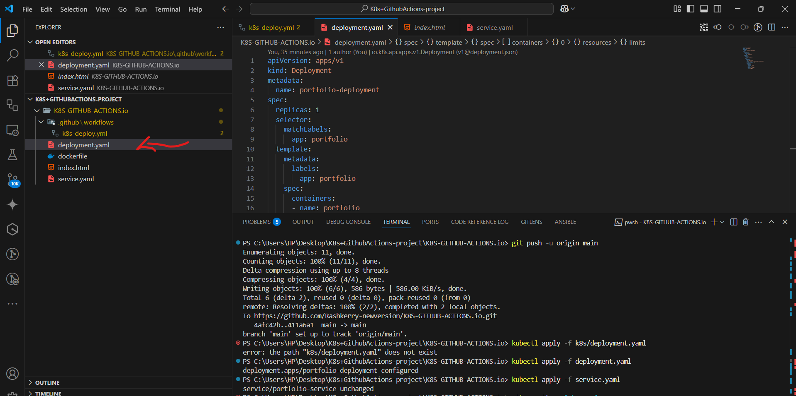

- Access the app:

```bash
minikube service portfolio-service
```

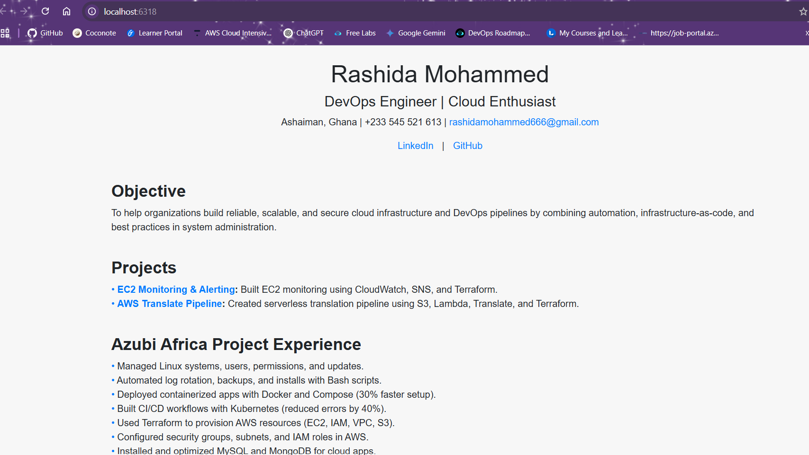

---

## 👀 Optional: Visualize with Lens

- Open Lens

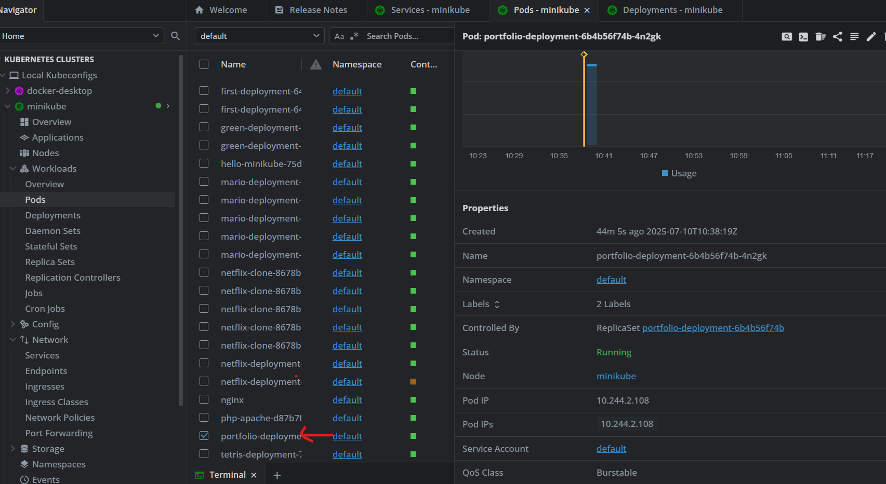

- Connect to your Minikube cluster
- View deployments, pods, and services

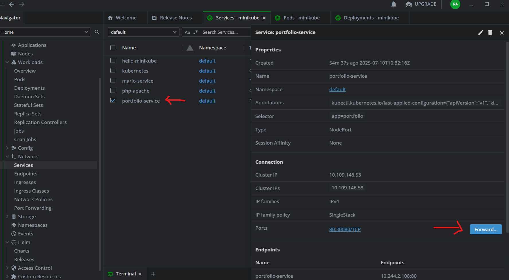


---

## 🧨 Teardown: Destroy Kubernetes Resources

```bash
kubectl delete -f deployment.yml
kubectl delete -f service.yml
```

---

## 📬 Contact

**Rashida Mohammed**  
🔗 [LinkedIn](https://www.linkedin.com/in/rashida-mohammed-cloud)  
💻 [GitHub](https://github.com/Rashkerry-newversion)

---

MIT © 2025 Rashida Mohammed
